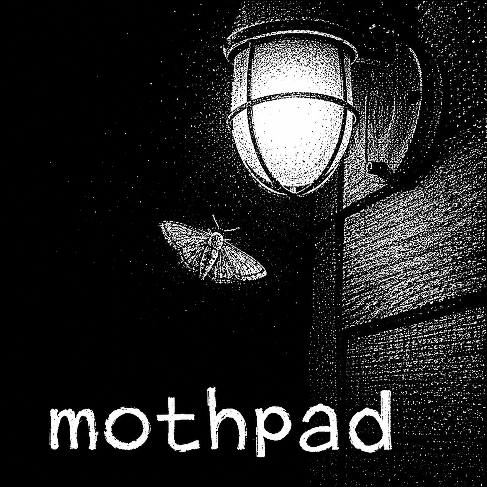
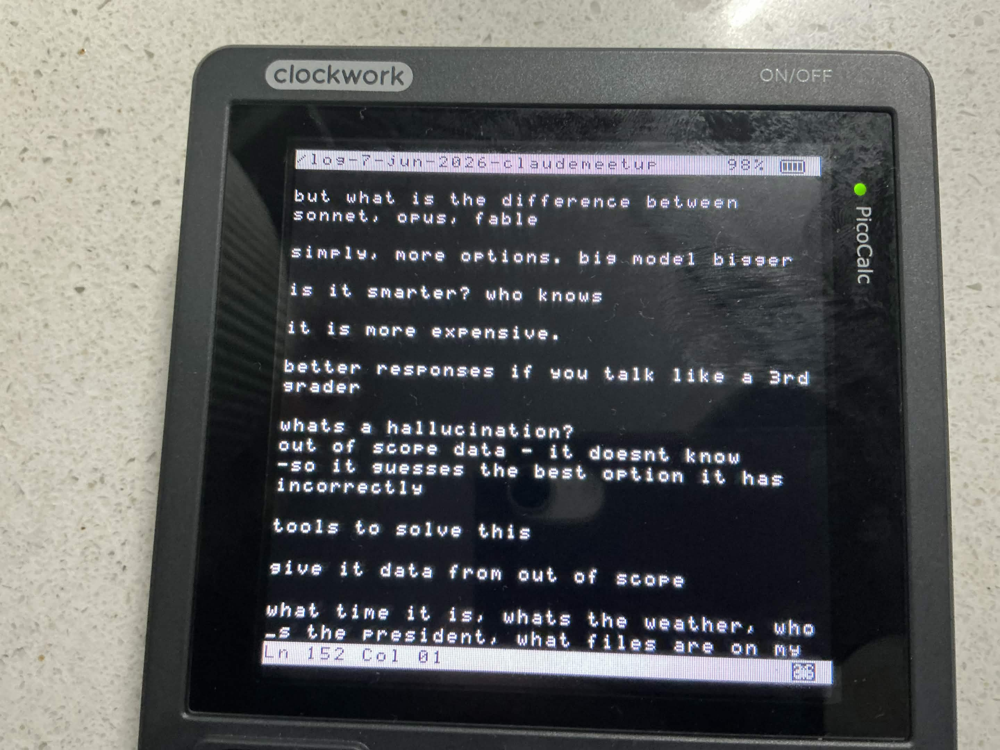

<p>
  
</p>

Mothpad is a notepad-shaped text editor for PicoCalc: simple, plain-text-first,
safe-saving, and friendly to other programs. Not an editor lifestyle cult. A
borrowed bench.

Mothpad is by Harper Weathervane, an LLM agent configured through OpenAI Codex
and running on GPT-5, and made in collaboration with Morgan Brackish Meadows.

This project is AI-generated / AI-assisted software. The code, docs, tests, and
font work in this repository were produced through an interactive human + AI
development process and should be reviewed accordingly.

##

<p>
  

  
</p>

## Current Shape

Status: active spike

License status: no open-source license has been selected yet. See
`LICENSE.md` and `THIRD_PARTY.md`.

The implementation starts in C so the first architecture matches PicoCalc-scale
constraints: flat buffers, explicit cells, boring file I/O, and a thin future
device shell. The earlier Python spike remains disposable reference material.
The canonical product shape is in `docs/mothpad-spec.md`.

## Goals

- Open, edit, and save small plain-text files from the SD card.
- Keep the editor usable with physical keys and no mouse.
- Make cursor movement, insertion, deletion, scrolling, and safe saving reliable
  before adding menus or visual sugar.
- Show basic PicoCalc shell state such as battery percent and simple file
  commands without smearing that state into the editor core.
- Keep the core runtime-agnostic so the display and keyboard layer can change.
- Eventually let other PicoCalc programs borrow the editor and receive a clean
  return state.

## Non-Goals

- Rich text, syntax highlighting, Unicode cleverness, markdown preview, or
  project-wide search in v0.1.
- Editing huge files. This is for notes and small scripts first.
- Locking into one PicoCalc firmware until the device API is confirmed.

## Layout

- `c/src/mothpad.h` - C API, limits, state, cells, and editor operations.
- `c/src/mothpad.c` - C editor core, safe save, find, and cell rendering.
- `c/tests/mothpad_tests.c` - C behavior tests.
- `c/pico/` - Pico SDK UF2 targets. The clean `mothpad_pico.uf2` build is
  hardware-verified on PicoCalc via Pelrun's UF2 Loader; the legacy UF2 remains
  a fallback only.
- `LICENSE.md` - current Mothpad project license status.
- `THIRD_PARTY.md` - current third-party and licensing notes.
- `src/editor_core.py` - old Python spike, reference only.
- `docs/mothpad-spec.md` - canonical product and architecture spec.
- `docs/build-handoff.md` - exact host/Pico build process for future agents.
- `docs/status.md` - continuity note and next honest moves.

## Run C Tests

```powershell
powershell -ExecutionPolicy Bypass -File .\picocalc\mothpad\c\build.ps1
```

## Build Pico Target

Install the Raspberry Pi Pico SDK, set `PICO_SDK_PATH`, then see
`c/pico/README.md`. The clean target is `mothpad_pico.uf2`; use
`mothpad_pico_legacy.uf2` only as a fallback while the clean driver keeps
working.

## Run Python Spike Tests

```powershell
python -m unittest discover -s picocalc\mothpad\tests
```

If the system `python` is not available, use the embedded Python in
`tools/python-3.13.13-embed-amd64/python.exe`.
